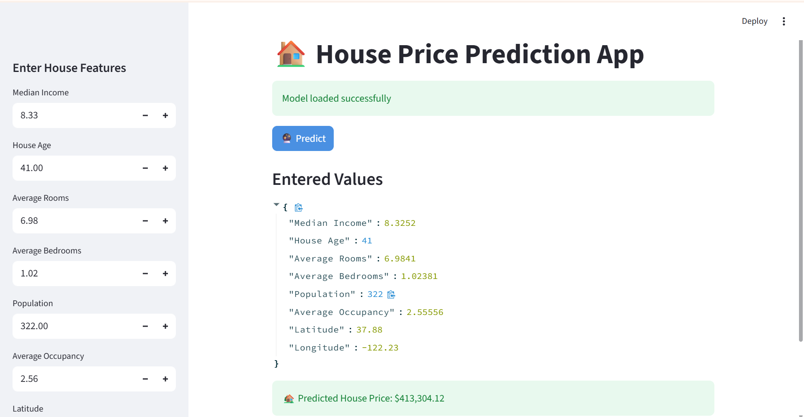

# 🏠 House Price Prediction App

A Machine Learning web application built with **Streamlit** that predicts house prices using the **California Housing Dataset**.

The project demonstrates a complete **end-to-end ML workflow**:

- Data exploration
- Model training
- Model evaluation
- Model deployment with Streamlit

---

# 🚀 Demo

The app allows users to input housing features such as:

- Median Income
- House Age
- Average Rooms
- Average Bedrooms
- Population
- Average Occupancy
- Latitude
- Longitude

and predicts the **estimated house price**.

---
# 📸 App Preview
Below is the interface of the **House Price Prediction Streamlit App**.



---
# 📊 Dataset

This project uses the **California Housing Dataset** available in `sklearn.datasets`.

Features include:

| Feature | Description |
|-------|-------------|
| MedInc | Median income in block group |
| HouseAge | Median house age |
| AveRooms | Average number of rooms |
| AveBedrms | Average number of bedrooms |
| Population | Block group population |
| AveOccup | Average house occupancy |
| Latitude | Latitude location |
| Longitude | Longitude location |

**Target variable:** MedHouseVal

The target value represents **median house value in units of \$100,000**.

---

# 🧠 Machine Learning Models Used

Several regression models were explored:

- Linear Regression
- Lasso Regression
- Ridge Regression
- Decision Tree Regressor
- Random Forest Regressor

The final deployed model is:

#### Random Forest Regressor Pipeline

Saved as:

`rf_pipeline_model.pkl`

---

# 🛠️ Tech Stack

- Python
- Scikit-learn
- Pandas
- NumPy
- Matplotlib
- Seaborn
- Streamlit
- Joblib

---

# 📁 Folder Structure
```
house-price-app/
│
├── app.py                       # Streamlit application
├── housing_model_training.ipynb # Model training notebook
├── rf_pipeline_model.pkl        # Saved ML model
├── requirements.txt             # Project dependencies
├── assets/
│   └── app_screenshot.png
├── README.md                    # Project documentation
└── .streamlit/
    └── config.toml              # Streamlit theme configuration
```
---

# ▶️ How to Run the Project

### 1️⃣ Clone the repository

```bash
git clone https://github.com/Varshita-J/house-price-app.git
cd house-price-app
```
### 2️⃣ Create a virtual environment

```bash
python -m venv venv
```

Activate the environment:

**Windows**
```bash
venv\Scripts\activate
```
**Mac / Linux**
```bash
source venv/bin/activate
```
### 3️⃣ Install dependencies
```bash
pip install -r requirements.txt
```
### 4️⃣ Run the Streamlit app
```bash
streamlit run app.py
```

The app will open at:
```
http://localhost:8501
```

